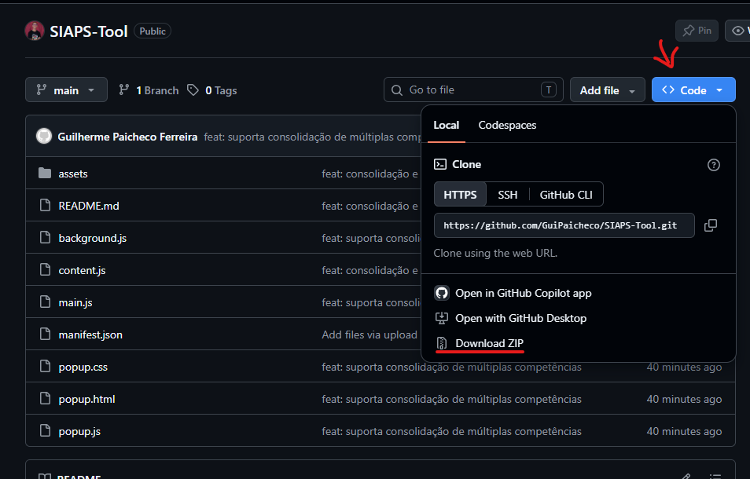
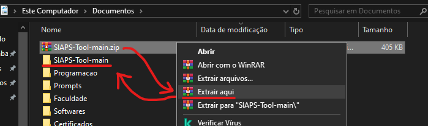
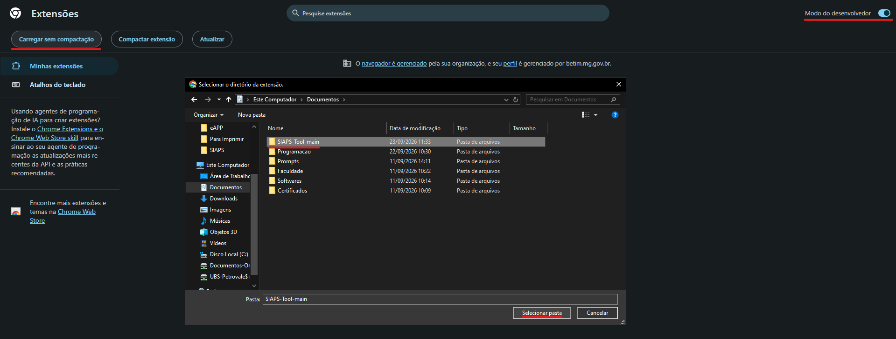
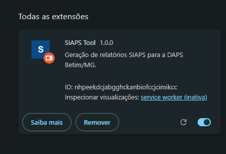
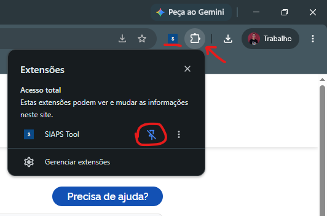
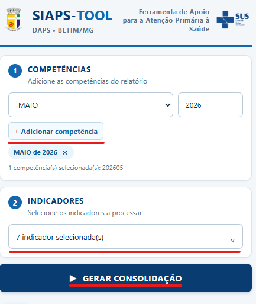
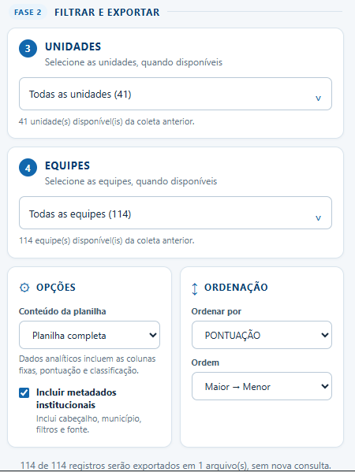

# **SIAPS-TOOL**

Extensão para Google Chrome. Ferramenta interna da **_Diretoria de Atenção Primária á Saúde - Betim/MG_** para facilitar a consolidação das planilhas no **_SIAPS_**.

## Tutorial para Instalação e Uso da Ferramenta

### Instalação:

1. Faça o **download** da ferramenta em ".zip":

`Baixe por aqui`:

ou

`Link pelo Drive`: (**PRECISA** estar logado no **e-mail INSTITUCIONAL**): https://drive.google.com/file/d/1Fe0-hM-1GPzs0F2tb5_yxi7ViiGQ9MWB/view?usp=sharing

2. Faça a extração do arquivo (mantenha-o em algum lugar seguro para não apagar):

3. Abra "[chrome://extensions](chrome://extensions)" no Google Chrome.
4. Ative o **Modo do desenvolvedor**.
5. Clique em **Carregar sem compactação** e selecione a pasta que foi extraída.

**EXTENSÃO IMPORTADA!**

---

### Uso:

1. **Fixe** a estensão para acesso facilitado.

2. **Faça o login** no SIAPS e acesse a **Visão por Competência**.
3. **Clique** no ícone da extensão.
4. **Adicione cada um** dos períodos de **competência** que desejar.
5. **Selecione** todos os **indicadores** desejados daquela competência.

3. Clique em **Gerar consolidações**. Essa etapa consulta o SIAPS e mantém os resultados em memória na própria aba do SIAPS, ela ainda não baixa os arquivos.
4. Após a consolidação, **filtre unidades e equipes** que desejar, defina o modo de dados, **cabeçalho** e **ordenação**.

5. Clique em **Baixar planilha**. A exportação reutiliza a consolidação existente, sem nova consulta à API.

> O modelo desta versão é um XLSX por indicador e por competência. Quando os filtros resultarem em mais de um arquivo, o popup mostra uma confirmação com a quantidade de arquivos e registros antes de iniciar os downloads.

## Modos de Formatação

- **Planilha completa:** Inclui as variáveis do indicador, além das colunas fixas. 
 PÚBLICO: Ideal para análises mais detalhadas.
- **Apenas dados analíticos:** Mantém apenas o necessário. Colunas fixas e pontuação com classificação.
 PÚBLICO: Ideal para informações rápidas.

Os metadados referem se aos dados de confirmação da planilha, que trazem dados como competência, indicadores, etc. Necessário apenas para verificação.

## Limitações importantes

- Mantenha a **mesma aba SIAPS aberta e sem recarregar** entre a consolidação e o download. A consolidação é invalidada se a aba for recarregada, fechada ou trocada.
- Fechar o popup não interrompe uma execução. Ao reabri-lo, o status e os logs recentes são recuperados enquanto a aba SIAPS permanecer válida.
- Muitas competências e indicadores podem consumir memória da aba. A versão não impõe limite, mas recomenda consolidar conjuntos grandes em lotes menores quando necessário.
- A disponibilidade de dados depende do SIAPS para cada competência e indicador selecionado.

---

Em casos de dúvidas ou sugestões, envie um e-mail para guilherme.paicheco@betim.mg.gov.br! 
  Um bom trabalho a todos!